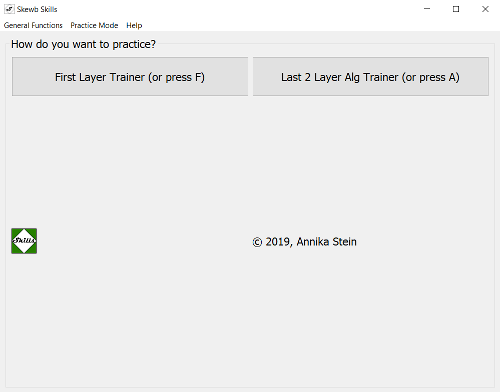
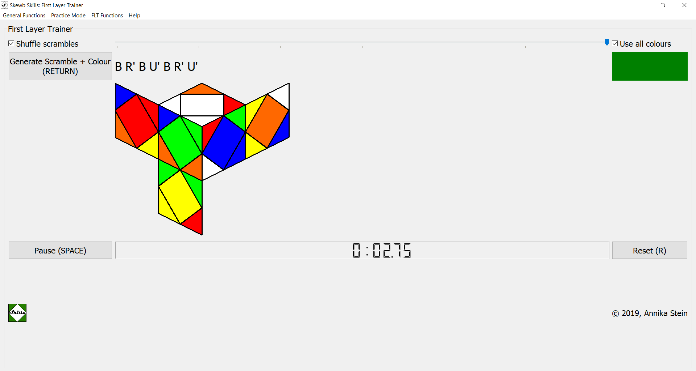
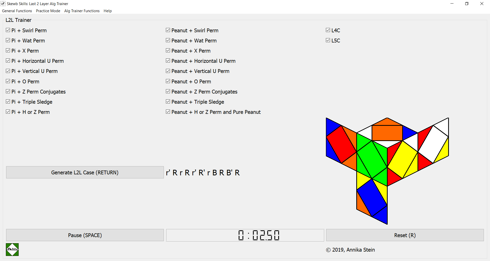
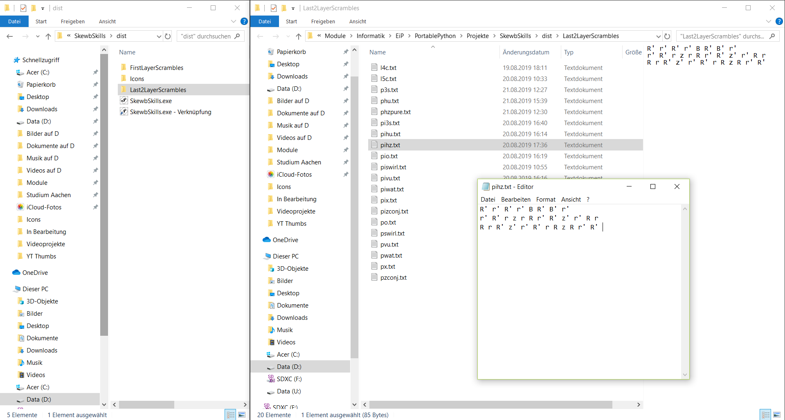

# SkewbSkills
Practice and learn skewb algs, first layer and more!

This description intends to show you how to use SkewbSkills and give a quick 
overview on the development process.

*NEW NEW NEW: SkewbSkills is now available as a [webpage](https://annikastein.github.io/SkewbSkills/SkewbSkillsWeb/skewbskillsweb.html) 
and can be downloaded as a [.zip folder](https://github.com/AnnikaStein/SkewbSkills/releases/download/v1.2/SkewbSkillsFilesv1.2.zip),
containing an .exe.* Read more about installation below.

SkewbSkills is free to use for all skewbers out there (!) and has been created 
by Annika Stein (also known as HugaCuba on social media such as 
[YouTube](https://www.youtube.com/channel/UCbqOLjnPUxAvBx2GB3tTZAw) or 
[Instagram](https://www.instagram.com/hugacuba/)) to
+ practice the first layer
+ practice algs for the last two layers
+ practice programming with python and qt. ;)
+ *new: practice html, css and javascript!*

# What's new?
## As of 27.11.2019
... I added some buttons (for each case!) that make you select exactly
the cases you want to practice. Also, the possibility to select groups
of algs is still there, so using both approaches, you can at least
increase the probability to receive certain cases up to a factor of 2.

Another minor improvement is a simple button that lets you show or hide
the scramble image as has been requested some time ago in the
FB group "Cyoubx's Friends" and / or "Skewbers". Thank you all for 
your ideas and critique, it helped a lot! Sorry that it took longer
than expected, physics is time consuming. ;)
## Some improvements on SkewbSkillsWeb
You can now use a stopwatch on SkewbSkillsWeb, on any mobile device
or on a laptop / computer / whatever! The responsive design of the jekyll
theme allows us to adjust the size and appearance of buttons and content,
giving us a nice layout everywhere.

And if you improve your best time for each L2L case, a prompt
is going to tell you that you got a PB!

You might not be able to change / adjust the scrambles atm, but the
feature mentioned above is SkewbSkiilsWeb-only and kind of a
compensation. ;)

Hopefully, someday more statistics will be implemented to get
detailed insight in your improvement.
## Release of SkewbSkillsWeb
Yes, you've heard correctly, SkewbSkills is now available as a webpage! This very first
web-based release might look a little ugly and lack a stopwatch, but it WORKS, apart 
from that! :)

Believe me or not, getting everything done in JavaScript was a bit of a mess as a 
complete .js newbie, but using my python scripts saved me a lot of time. Tbh, it took me
not more than three days (the last time using anything like html / css must have
been several years ago).

Seems like learning new languages is much easier than learning your first one. ;) (yOu DOn'T sAY?!)
## Release of 1.2:
+ Create subfolders that contain the scrambles and icons (thanks to Elias for
    the suggestion)
+ Added 'General Functions' menu with shortcut to close the window
+ Minor changes of the tooltips

Download v1.2 as a .zip-folder [here](SkewbSkillsFilesv1.2.zip).

## Release of v1.1:
+ Better way to generate the first layer trainer scrambles, less code, less 
disk space - faster in general.
+ (GERMAN) Video on SkewbSkills is published 
[here!](https://youtu.be/qSO3zM_-us4)
+ Stopwatch for the FLT, higher accuracy of the stopwatch compared to the 
first version
+ "Guide" for non-windows users added down below
+ minimum width of the scramble drawing to prevent overlap with the third 
column

Download v1.1 as a .zip-folder [here](SkewbSkillsFilesv2.zip).

## Release of v1.0:

You can now download and use version 1.1 of SkewbSkills! Browse through 
the source code on [github](https://github.com/AnnikaStein/SkewbSkills) or 
simply run the executable and have fun! More info on how to install your 
own copy of SkewbSkills down below.

Download v1.0 as a .zip-folder [here](SkewbSkillsFiles.zip).

# What's planned?
+ I'm working on a web-based SkewbSkills! You can find
  out how far I've come [here](https://annikastein.github.io/SkewbSkills/SkewbSkillsWeb/skewbskillsweb.html).
  The languages in use are html, css and javascript. You
  can expect it to work on most of the devices out there
  without downloading anything once it's done. ;)
  If your browser is able to cache .js, you will be able
  to use it offline for a while, at least. :)
  
  I'm adding more functions to it, and hopefully it will be as functional as the .exe
  version. At the moment it's lacking a stopwatch and the possibility to include your
  own algs. Some shortcuts could be added as well, and the design needs some improvement.
+ Add other practicing modes, or modify the current ones:
   + I'd like the user to identify weak algs and put them on a special pile 
   to work on particularly
   + add quiz where you only see three faces and have to identify the case
   + add competition sim where you get five scrambles, but only four times 
   a day ;)
   + add statistics for every L2L case that shows improvement
   + function to identify which cases you know, where you can put in your 
   own algs and keep track of the cases you know
+ Make SkewbSkills available to more platforms than Windows (see paragraph 
below for more information)

# Download and Installation (as webpage)
You don't need to worry about downloading or installing anything, you can access
SkewbSkills now directly from the web, as a [webbased application](https://annikastein.github.io/SkewbSkills/SkewbSkillsWeb/skewbskillsweb.html)!

If you want to, grab yourself a browser that is able to store websites (save all data
required, e.g. by pressing Ctrl + S) and use SkewbSkills offline, as well!
# Download and Installation (as desktop application)
## Windows
Download the zip-file, containing the .exe, some pictures and .txt files. 
Do not move the .txt-files out of the directory, they contain the scrambles.
Actually, using my pictures is not necessary, but they are included for 
design purposes.

To open the program, extract the zip-folder and open "SkewbSkills.exe" 
(v1.1 and up) or "MainWindow.exe" (v1.0), either by using the executable 
itself, by defining a shortcut (which is pretty nice if you want to put the 
program on your desktop or the taskbar). What you can also do is run the 
MainWindow.py-code (for those of you that have a python interpreter set up).
For the latter, you would have to download the sources in the repository and
make sure all packages are installed. Therefore, this option is only recommended
for more experienced users, because you might have to get PyQt5 etc. before you
can run the application.

*Note*: since the .exe is really new and not many people use it, you might 
have to allow your computer to execute it. This also applies to antivirus 
software if you use some.

## Other platforms

At the moment, SkewbSkills is only available as an .exe-file. Therefore, 
if you want to use SkewbSkills on a different platform than windows, you 
might want to consider using a software called "Wine" (freeware, on macOS 
or Linux for example). 

+ [GERMAN Tutorial for macOS](https://www.youtube.com/watch?v=rINx-ojfZSU)
+ [ENGLISH Tutorial for macOS](https://www.youtube.com/watch?v=Bz-nI4LW2Jw)
+ [GERMAN Tutorial for Linux](https://www.youtube.com/watch?v=Q8vpGNje67k)
+ [ENGLISH Tutorial for Linux](https://www.youtube.com/watch?v=lI09QLkqZiE)

Besides that, there is always the option to download the sources and run 
"MainWindow.py" on your machine using Python 3.

If I'm informed correctly, it should already be possible for linux users to 
run python files, but the package 'PyQt5' has to be installed.

# Update your version

Updating your version of SkewbSkills is pretty easy. Just download the newest
.zip-folder and remove the previous one. It's also possible to use more than
one version on the same device, if you do not mix the files into one folder
or randomly copy/paste from one to another version.

If you have modified your scrambles and want to use them in your updated
version of SkewbSkills, download the newest version and only change each
scramble file you have overwritten with your own algs. In newer versions, the
files might be located in other folders, but they will be named the same way
as before.

# Usage
After opening SkewbSkills, type "H" or choose Help from the menubar to get 
(almost) the same instructions as below. You can close every window inside
SkewbSkills by pressing ESCAPE.

## Starting Window

Choose any from the different practicing modes, by pressing the corresponding 
button or key, respectively. A new window appears, the starting window closes. 
*Note*: the First Layer Trainer might take some time to open, so be a little 
patient (especially for v1.0 users).

## First Layer Trainer

There's a slider to define the length of the scrambles, you can choose 
between 1 and 7 moves. This can also be done with the keys 1 to 7 on your 
keyboard, if you're using v1.1 and up. If you want the scrambles to be 
shuffled, use the checkbox "Shuffle scrambles" (shortcut: S). 
The checkbox "Use all colours" (with its shortcut C)
allows SkewbSkills to show you various colours so that you can practice to 
start the first layer with every color (to become CN). 
When you're ready with the customization, press "Generate Scramble + Colour" 
(or RETURN). A new scramble appears, both as a label containing the scramble 
sequence, and with a drawing.
If you want to time yourself solving the first layer, use the stopwatch with
its two buttons, Start (SPACE) / Pause (SPACE) and Reset (R).
*Small warning, especially for v1.0*: the more moves you select, the larger 
the files are that contain the scrambles. Therefore, it might take a little 
until the process is completed. In further versions such as v1.1 and up, this 
should not be the case anymore.

## L2L Alg Trainer

Select all the alg sets that you'd like to practice. This can be done manually
by checking or unchecking them via mouseclicks, or by pressing "T" ((un-)select
all sets), "L" ((un-)select L4C, L5C), "I" ((un-)select all Pi cases) and "U" 
((un-)select all Peanut cases).
SkewbSkills is going to shuffle (randomize) the order in which they appear.
Use the "Generate L2L Scramble" Button or press RETURN to generate a scramble. 
A drawing of the scramble appears. All scrambles are performed with the 
White/Red/Green Corner on top/front. Start the timer with the "Start" Button 
or press SPACE. After starting the timer, you can stop it again by clicking 
the same button ("Pause") or pressing SPACE again. You can than reset the 
timer to zero by using the "Reset" button (or press "R").

## Your own algs

You do not need to change anything on any file anymore once you've extracted 
the folder. But: if you find that you'd like other scrambles to be displayed 
than the current ones, open any of the .txt-docs and modify the scrambles to 
your liking. If you want to keep track of which scrambles generate which case, 
see [this document](https://docs.google.com/spreadsheets/d/1j-SGlgZk20D3d2TyeiXhMWzeyTBuuix3Owgj9Q8rNbo/edit#gid=1743463298)
(credits: Elias Malomgré and Carter Cucala). I use the same terms for the 
cases to indicate them, as well as the same order.

Keep in mind that you need to write scrambles, not solutions for the different
cases. You need to inverse your preferred solution to get the scramble you want.
I chose the not so common solutions as scrambles, because than you can't see your
solution by staring at the scramble and simply reading it backwards. That way you
are forced to come up with a solution yourself. ;)

When modifying the scrambles in the .txt-Files, note that the very last 
character of the file must be one space in the line of the last scramble. 
So do not make any additional line break after the last scramble, but end 
the line of the last scramble with a space.

In almost the same manner, do not use a space or anything else to end the 
previous scrambles. All lines that are not the last line should only contain 
the scramble itself, ending with the last move. If you do not apply the steps 
above, your program might crash (because it can only read and use the 
scrambles provided in the form mentioned earlier).

# Credits
As I am just starting out Python (and PyQt5), I had a lot of input from 
various online sources.
I learned a lot from [this playlist](https://www.youtube.com/playlist?list=PL1FgJUcJJ03uO70zDLDF3oaTu6s2QLOPa)
by Parwiz Forogh and also used [this project](https://github.com/enkore/qt-stop-watch.py/blob/master/qt-stop-watch.py) 
by enkore to get the stopwatch running. Also thanks to Mattheo de Wit, who 
created a similar (but web-based) [application!](https://yutu58.github.io/?fbclid=IwAR2cVMBE9LneUZ1J0XpDWPcTV2XjGsCDmXmTCIu4qhWUh7EJIDhA-f0eNTY)
This was a big influence on how the L2L-Trainer should work.

When reading the [LICENSE](https://github.com/AnnikaStein/SkewbSkills/blob/master/LICENSE) 
doc, you might find out that you are not only free to use the program, but 
also the source code. This is to ensure everyone can learn something, of 
course I appreciate every suggestion for improvement, as I might actually be 
the one to learn something through this project! :)

# Other links
If you want to get to know about my other activities, visit my 
youtube channel: [HugaCuba](https://www.youtube.com/channel/UCbqOLjnPUxAvBx2GB3tTZAw/).

# Further questions?
Feel free to write me an [E-Mail](mailto:dwnhugatv@gmail.com) 
if you have further questions or want to suggest a new feature. Also, if you
detect some bugs or malfunctions, this might be the way to go. Another
possible way to ask something about SkewbSkills in any way is to 
publicly comment on this [Youtube Video](https://youtu.be/qSO3zM_-us4).

# Donate
Feel free to donate via PayPal, I'd be more than happy to learn
new techniques, make SkewbSkills available to other platforms
or do whatever I can to help you improve in the skewb event!
